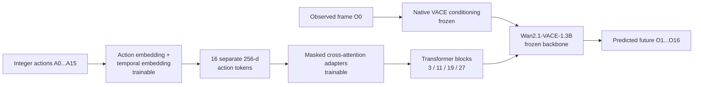
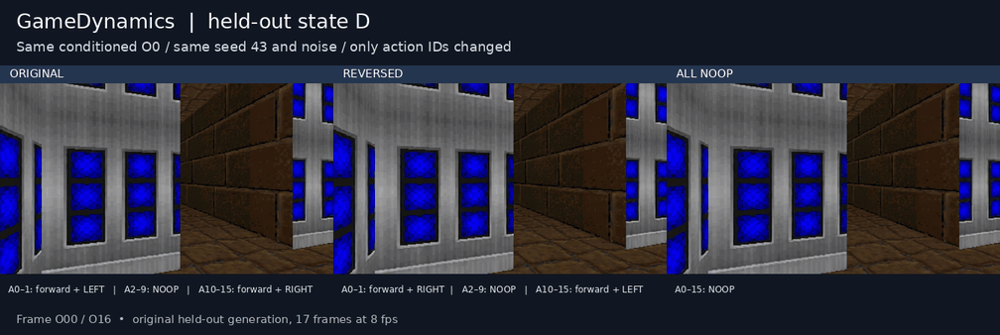

# GameDynamics

**Action-Conditioned Gameplay World Model**

GameDynamics predicts short gameplay futures from one observed frame and a sequence of discrete actions:

\[
O_0 + A_{0:15} \rightarrow \hat{O}_{1:16}
\]

The final showcase model pairs a frozen **Wan2.1-VACE-1.3B** video backbone with a 3.68M-parameter action-token cross-attention adapter. The project covers trajectory collection, leakage-safe dataset construction, parameter-efficient training, and held-out counterfactual evaluation.

## Overview

The model receives the exact current RGB observation, 16 integer action IDs, and a generic scene prompt. VACE uses the current frame through its native first-frame conditioning path. A learned adapter injects temporally aligned action tokens at four transformer depths and predicts the next 16 frames.

The repository contains the full research path, including unsuccessful conditioning designs and audit artifacts. The showcase checkpoint is the **M6F-2 step-6400 adapter**.

## Problem

Text-conditioned video models can generate plausible gameplay while ignoring the controls that should cause motion. GameDynamics asks a stricter question: given the same observed state and matched diffusion noise, does changing only the action sequence produce the expected counterfactual camera motion?

Evaluation includes ordinary action-direction accuracy and matched-seed ORIGINAL versus REVERSED tests. It also measures whether NOOP suppresses motion.

## Dataset

- **51** ViZDoom `my_way_home` trajectories
- **3,088** indexed RGB/depth/action clips
- Six preserved integer actions: forward, left, right, forward-left, forward-right, and NOOP
- Episode-level train/validation/test split, preventing overlapping frames and adjacent states from crossing splits
- Deterministic manifests with source paths, action sequences, processing settings, and checksums
- Final adapter training on a deterministic **128-clip TRAIN-only subset**; evaluation on four unseen states from validation/test episodes

The source data pipeline stores RGB, depth, exact action labels, rewards, terminal metadata, and provenance. See [`data_pipeline/`](data_pipeline/) for collection, validation, clip construction, statistics, selection, and split tools.

## Model

- Backbone: `Wan-AI/Wan2.1-VACE-1.3B-diffusers`
- Native VACE first-frame conditioning for observed \(O_0\)
- Output: 17 frames at 448×256; evaluation treats \(O_0\) as observed and scores generated \(O_1\ldots O_{16}\)
- Frozen VACE transformer, VAE, and text encoder
- Generic prompt for every sample: “A first-person gameplay view in a retro 3D stone maze.”
- Showcase adapter: M6F-2 step 6400, **3,684,864 trainable parameters**

## Action-Conditioning Architecture

Each of the 16 action IDs remains a separate token. A learned action embedding is added to a learned temporal embedding. Cross-attention adapters use video states as queries and action tokens as keys and values. The temporal mask exposes each future latent group only to its four aligned action tokens; observed latent 0 receives no direct future-action input.



The implementation is in [`vace_action_token_prototype.py`](training/wan/vace_action_token_prototype.py). Its zero-initialized output projections preserve the pretrained path before adapter training.

## Training

The final model starts from the same seed-42 zero initialization as the controlled baseline and trains only the action adapter for 6,400 optimizer steps:

- AdamW, learning rate `2e-4`, batch size 1
- BF16 backbone with all pretrained parameters frozen
- Future-only denoising loss on temporal latent positions 1–4
- Correct and deterministically LEFT/RIGHT-swapped action forwards share the same target, timestep, noise, text, current-frame condition, and model state
- Locked TRAIN-only ranking objective: margin `0.01`, weight `0.25`

The official checkpoint was fixed at step 6400 before held-out evaluation. Training code and its exact protocol are in [`m6f2_contrastive_train.py`](training/wan/m6f2_contrastive_train.py) and [`train/protocol.json`](data/experiments/m6f2_action_contrastive_128_6400/train/protocol.json).

## Evaluation

Four held-out current states were evaluated under ORIGINAL, REVERSED, and ALL-NOOP action conditions with seeds 42, 43, and 44: **36 generated videos**. Within each matched state/seed group, only action IDs changed; \(O_0\), prompt, initial noise, model, and inference settings were fixed.

The future-only optical-flow scorer excludes the observed-to-generated \(O_0\rightarrow O_1\) transition. It reports turn-direction accuracy, action-motion correlation, NOOP motion ratio, and matched-seed LEFT/RIGHT flips. The scorer and immutable result artifacts are in [`m6f2_contrastive_eval.py`](training/wan/m6f2_contrastive_eval.py) and [`eval/`](data/experiments/m6f2_action_contrastive_128_6400/eval/).

## Results

| Held-out metric | Result | Predeclared threshold | Outcome |
|---|---:|---:|---|
| Turn direction accuracy | **0.887** | ≥ 0.70 | PASS |
| Median absolute action-motion correlation | **0.786** | ≥ 0.50 | PASS |
| Median NOOP motion ratio | **0.572** | ≤ 0.50 | FAIL |
| Matched-seed LEFT/RIGHT flip | **7/12** | ≥ 9/12 | FAIL |

The final model passes two of four held-out criteria. It learns useful action-aligned direction and correlation signals, while NOOP suppression and consistent counterfactual reversal remain unresolved.

## Demo



[Download the synchronized MP4](demo/heldout_state_D_seed_43.mp4) · [Composition manifest](demo/showcase.json)

This test-state example uses seed 43. The three panels share the same observed \(O_0\), prompt, initial noise, model, and inference settings; only action IDs differ. Both its first and final turn-flip checks pass. The demo composes existing M6F-2 videos and does not run or alter the model outputs.

## Ablations / Key Findings

- The original T2V Control LoRA did not provide reliable multi-state current-frame conditioning.
- Native VACE conditioning retained held-out state identity well, though its decoded O0 missed the project’s strict hard-anchor threshold.
- A coarse additive action bias produced distinct, strong internal perturbations but failed semantic action-control metrics.
- Keeping all 16 actions as separate temporally embedded tokens and injecting them through masked cross-attention passed all four tiny-set control criteria.
- Scaling to 128 clips improved held-out direction and correlation, but generalization remained partial.
- Contrastive correct-versus-swapped training improved direction accuracy and correlation relative to the standard 128-clip objective. It did not improve matched-seed flips and still missed NOOP suppression.
- M6G-0B found that none of the five failed first-turn flips recovered during O2→O3, O3→O4, or O4→O5. The short-horizon failures are not explained by a simple delayed reversal within the first latent window.

See [`docs/EXPERIMENT_SUMMARY.md`](docs/EXPERIMENT_SUMMARY.md) for the compact experiment progression.

## Limitations

- This is a focused ViZDoom research prototype, not a general-purpose world model.
- Final training used 128 clips from one scenario; held-out evaluation contains four states and 12 matched action pairs.
- NOOP motion is not suppressed to the predeclared target.
- Five of 12 matched first-turn counterfactual pairs fail, and the failure persists through the first latent window.
- Optical flow is a motion proxy; it does not measure all aspects of gameplay correctness, geometry, or long-horizon consistency.
- The current VACE mask behavior was kept fixed throughout controlled comparisons.

## Repository Structure

```text
data_pipeline/                  ViZDoom collection and deterministic dataset tooling
training/wan/                   VACE action adapter, training, inference, and audits
evaluation/README.md            Evaluation entry points and artifact map
demo/                           Presentation demo and reproducible compositor
docs/EXPERIMENT_SUMMARY.md      Research progression and final conclusions
data/experiments/               Immutable protocols, logs, checkpoints, videos, metrics
tests/                          Dataset and adapter checks
```

The `training/wan/` milestone scripts preserve experiment provenance. Earlier LoRA, additive-adapter, smoke, checkpoint-trajectory, and audit entry points are historical or debug-only; use the M6F-2 files above when reviewing the final system. They remain in place so results are reproducible.

## Reproduction

### Data pipeline

```bash
python3 -m venv .venv
source .venv/bin/activate
pip install -r requirements.txt

python data_pipeline/collect_vizdoom.py \
  --scenario my_way_home --episodes 1 --max-steps 500 \
  --output data/episodes

python data_pipeline/process_dataset.py \
  data/episodes/my_way_home --clips-output data/clips \
  --clip-length 16 --stride 8 --fps 8

python data_pipeline/build_dataset_index.py \
  data/clips/my_way_home --output data/datasets

python data_pipeline/split_dataset.py \
  data/datasets/my_way_home/all_clips.json --seed 42
```

### Final adapter artifacts

The exact training settings, fixed subset checksum, initialization checksum, and objective are recorded in the [training protocol](data/experiments/m6f2_action_contrastive_128_6400/train/protocol.json). The official checkpoint is:

```text
data/experiments/m6f2_action_contrastive_128_6400/checkpoints/step_6400/adapter.pt
```

Reproduce scoring from already generated videos without model inference:

```bash
python training/wan/m6f2_contrastive_eval.py score
```

Rebuild the presentation asset from existing videos:

```bash
python demo/make_showcase.py
```

GPU training and generation require the pinned environment represented by the saved protocols and local Diffusers-format VACE weights. Research experiments are frozen; the repository’s existing artifacts are the official results.
